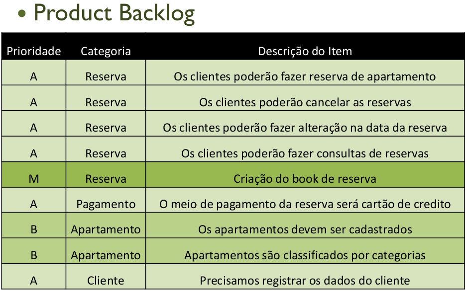
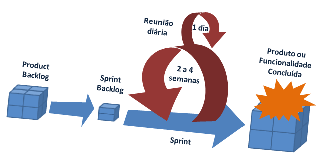

# Projeto e Prática 2
<h3>Repositório para a disciplina de Projeto e Prática 2 - IFPE</h3>
<h5>Professor: Francisco do Nascimento  
E-mail: francisco.junior@jaboatao.ifpe.edu.br
</h5>

<a href="README2.md">Página da Unidade 1</a>

<h3>UNIDADE 2</h3>

#### Aula 05/07/16
Product Backlog: <a href="https://docs.google.com/spreadsheets/d/1mT06z1S-aei-hQu_1uGNm1aIOUzECAcC6GJ-lC4Uiwk/edit?usp=sharing">Planilha</a> 
Atividade: Cada grupo deve entregar pelo menos 6 histórias do usuário com prioridade ALTA e MEDIA.
 
História do Usuário #36 (Tela de Login): <a href="https://docs.google.com/document/d/1aP5cGHkk2McuS3XoZuT9A-J4aGn5G9NemwGb9HAH0r4/edit?usp=sharing">Visualizar</a>

#### Aula 01/07/16
1) Definir o product backlog
* Cada grupo vai desenvolver o Product Backlog para cada um dos módulos (Cadastro, Atendimento, Faturamento)
* Finalizar durante a aula: Uma planilha no seguinte modelo  
 

2) Escrever as histórias do usuário definidas no Product Backlog
* Modelo: <a href="HistoriasUsuario.doc">História do usuário de exemplo</a>
* Entrega: próxima aula (05/07/16)

-----

#### Aula 28/06/16
SCRUM

* https://www.youtube.com/watch?v=xa-C0No2Uic
* https://www.youtube.com/watch?v=XfvQWnRgxG0
* Slide: <a href="https://www.dropbox.com/s/g0as8obk1sh9h6q/PP2-Aula06-Scrum.pdf?dl=0">PDF</a>

HISTÓRIAS DO USUÁRIO: 
* http://blog.myscrumhalf.com/2011/10/user-stories-o-que-sao-como-usar/ 

---------
#### ATIVIDADES 

. | Descrição | Data de finalização
--- | --------|-------
1 | Definir equipe | 28/06/16
2 | Definir cliente e tipo de sistema | 28/06/01
3 | Realizar entrevistas com o cliente e coletar o máximo de histórias de usuário possível | 01/07/16
4 | Definir as prioridades de cada história de usuário | 01/07/16
5 | Dividir cada história de usuário em tarefas | 05/07/16
6 | Definir as prioridades das tarefas | 05/07/16
7 | Planejar as 9 semanas de trabalho: de 12/07/16 a 10/09/16 | 08/07/16
8 | Criar quadro Scrum  | 08/07/16
9 | Para cada iteração:   - Definir backlog    - Implementar as tarefas   - Testar as tarefas    - Testar o sistema   |
10 | Avaliação do projeto | 09/09/16
11 | Apresentação ao público | 13/09/16
   

ENTREGAS (tudo no GitHub)
<ol type=A>
<li>Diagrama de casos de uso</li>
<li>Documento de Arquitetura</li>
<li>Diagrama de classes</li>
<li>Diagrama de Entidade-Relacionamento</li>
<li>Script do Banco de Dados</li>
<li>Código-fonte da aplicação</li>
</ol>

##### NOTA DA UNIDADE 2: ENTREGAS + PARTICIPAÇÃO + APRESENTAÇÃO
 * Entregas: Máximo 4,0 pontos (entregou tudo no prazo, garante os quatro pontos)
 * Participação: Máximo 4,0 pontos (esforço e produtividade)
 * Apresentação: Máximo 2,0 pontos (média da nota dos demais professores)
